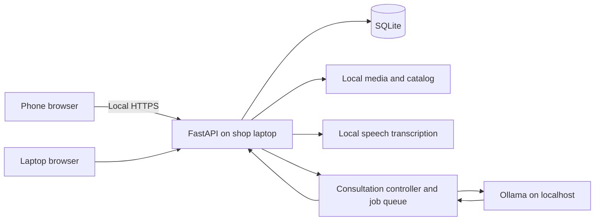

# GupAi — Product, UI, Local AI, and Backend Plan

**Tagline:** Para bago gumupit, nagkaintindihan muna.

**Date:** October 9, 2026 · **Status:** design specification for review; application not yet implemented.

This document consolidates the product context and latest requirements. Where earlier recommendations conflict, it supersedes them; its additions include the mirror-centered interface, voice-first interaction, named customer history, and advisory checkpoints. It is a development blueprint, not evidence that performance or professional accuracy has been validated.

> **Hackathon scope:** this is the full long-term specification. For the 24-hour build, `docs/PRD.md` (MVP stories S1–S10) and `docs/WORKFLOW.md` (schedule to the 10:00 AM freeze) are authoritative. `docs/VALIDATION.md` explains the cuts.

## 1. Product context

GupAi helps a barber and customer agree on an achievable haircut, remember that agreement during cutting, and retrieve a preferred haircut on the next visit. Meaningful AI inference runs on the shop laptop. A phone can provide the camera and interface over a local network without internet.

The original observation is personal: a customer may show a reference, struggle to describe the parts they like, then quietly tolerate an unexpected result. Avoid claims that most Philippine barbers do not use AI or that existing products cannot address this problem.

The primary users are neighborhood barbers and their customers, especially new customers, people changing styles, and returning customers who want a previous cut. The product assists their communication and decisions. The barber remains responsible for physical assessment and cutting; the customer remains authoritative about their preferences.

**Core outcome:** an understandable, editable haircut agreement, followed by a record of what was actually done.

**Success hypothesis:** clearer discussion reduces misunderstandings. This requires later observation with barbers and customers; a staged demo cannot prove it.

### Hackathon context

The provided briefing weights problem/usefulness at 25%, local AI at 25%, technical execution at 20%, innovation at 15%, and product/demo quality at 15%. Prioritize a reliable disconnected consultation over a large feature list. No visual style or concept guarantees a winning score.

| Criterion | Evidence GupAi should show |
|---|---|
| Problem/usefulness | A specific misunderstanding resolved through dialogue and an agreement |
| Local AI | A new photo and new customer correction processed with internet disconnected |
| Technical execution | Working consultation, persistence, recovery, and measured response times |
| Innovation | Barber-led consultation linked to preference memory and checkpoints; honest comparison with existing tools |
| Product/demo | A legible mirror interface and a short journey ending in a saved haircut |

## 2. Settled requirements and planning assumptions

### User-selected requirements

- Product name GupAi; retain the Tagalog tagline.
- Creamy, flat, modern visual design with Apple-like clarity and restraint.
- A mirror in the center of the consultation; a small SVG barber mascot elsewhere.
- Voice is the primary interaction, with typing, buttons, and haircut selections available.
- Use real hairstyle examples and annotated customer photos first. Generated makeovers are deferred.
- Both customer and barber participate in decisions.
- Save personalized haircuts locally under the customer's name and retrieve them on return visits.
- One shop laptop performs AI inference; ordinary phones use the browser.
- Explain options and trade-offs, accept corrections, and support barber-triggered checkpoints.

### Proposed defaults for implementation

- One active consultation and one inference job at a time for the prototype.
- Customer/barber speaker selection before recording; no automatic speaker identification.
- Tap to start/stop recording; an optional hold-to-talk shortcut is secondary.
- Short spoken replies when a tested offline voice is available; all replies also appear as text.
- Plain Taglish copy with English available.
- Light theme only for the hackathon.
- Photos and history are retained only with explicit consent. Temporary consultations remain possible.

## 3. Scope and priorities

### Hackathon release

1. Shop setup and local model readiness.
2. New or returning customer selection.
3. Reference-based and help-me-choose consultation paths.
4. Guided photo capture or upload.
5. Voice input, editable transcript, typing, and choice buttons.
6. Barber confirmation of visual observations.
7. Two source-backed haircut options from six supported families.
8. Corrections, conflict handling, and versioned haircut agreement.
9. One reusable advisory checkpoint screen.
10. Save a completed visit and retrieve a preferred haircut locally.
11. Connection and inference failure recovery.

The six initial families are crew cut, buzz cut, side part, textured crop, curtains, and short quiff. Do not force unsupported references into one of them. Sides/top variants must be compatible with a supported catalog entry and confirmed by the barber.

### After the core is reliable

- Additional checkpoint templates and richer history comparison.
- Kwentong Barbero: optional jokes, conversation starters, and explicitly fictional stories.
- More thoroughly validated Taglish speech output.
- Additional style families and professionally reviewed guidance.
- Generated hairstyle previews, separately evaluated and labeled illustrative.
- Multiple chairs, accounts for multiple barbers, and phone-only inference.

### Excluded from the first version

Scalp diagnosis, attractiveness scoring, facial recognition, exact automatic guard selection, autonomous cutting instructions, continuous clipper monitoring, cloud inference fallback, photorealistic makeover promises, online booking, payments, and a business analytics dashboard.

## 4. Visual direction: the consultation mirror

The physical scene is a barber and customer viewing a screen under ordinary shop lighting, sometimes at arm's length. Large readable controls and an unobstructed view matter more than decoration.

The interface should feel like a carefully designed personal tool. Interpret Apple-like design as strong hierarchy, clear state changes, restrained chrome, familiar controls, and attention to spacing. Do not copy Apple branding or introduce glass effects that conflict with the requested flat design.

**Signature:** the customer's mirror is the dominant shape; the haircut agreement sits beside it like a concise consultation note. The mascot adds warmth beside the prompt, never on the customer's face.

Use a restrained cream-and-ink palette with a deep green action color. Avoid gradients, glowing borders, glossy 3D mascots, excessive pills, floating dashboard cards, dramatic entrance sequences, simulated scan lasers, fake confidence percentages, and decorative AI sparkles.

### Proposed design tokens

| Token | Value | Purpose |
|---|---|---|
| Canvas | `#F6F3EC` | Warm cream page background |
| Surface | `#FFFDFA` | Sheets and editable content |
| Subtle surface | `#EAE5DA` | Secondary areas and photo placeholders |
| Primary ink | `#252821` | Titles and body text |
| Secondary ink | `#62645C` | Supporting copy; verify contrast on each surface |
| Action | `#365846` | Primary action and active selection |
| On action | `#FFFFFF` | Button label |
| Decorative separator | `#D8D2C6` | Nonessential dividers; not sufficient alone for control identification |
| Control boundary | `#77796F` | Inputs and meaningful boundaries |
| Focus | `#285EAE` | Visible keyboard outline |
| Error | `#A52B2B` | Error text and icon, accompanied by words |

Verify final combinations against WCAG AA before shipping. Proposed colors are not a claim of completed accessibility testing.

- Typography: system UI stack, including platform-native sans-serif fonts. No runtime font CDN; do not redistribute proprietary Apple fonts.
- Body: 16px minimum; primary prompt: 24–30px desktop and 22–26px mobile; secondary labels: 14px.
- Text measure: approximately 45–65 characters for explanatory paragraphs.
- Spacing: 4, 8, 12, 16, 24, 32, 48px.
- Corners: 10px controls, 16px sheets, 24–32px mirror frame. A pill is reserved for genuinely segmented controls or compact states.
- Buttons: at least 48px tall in touch layouts. One clearly dominant action per step.
- Icons: one bundled SVG family, consistent size and stroke. Visible labels accompany primary actions.
- Flat surfaces use fill, spacing, and borders. Avoid depth effects as decoration.

### Desktop composition

Target a 1440×900 viewport first, then verify at 1280×720.

```text
GupAi         Consultation                         Customers   Shop settings
Customer: Miguel · New visit                       Connected to shop laptop

 Concern     Photos     Preferences     Options     Agreement     Review

  CURRENT STEP              CUSTOMER MIRROR              NAPAGKASUNDUAN
  What should change?       ┌──────────────────┐         Keep
                            │                  │         Fringe coverage
  [small barber SVG]        │ Live preview or  │
  Ano ang gusto mong        │ reviewed photo   │         Change
  ayusin ngayon?            │                  │         Discuss sides
                            └──────────────────┘
  Quick choices             Front  Left  Right           Avoid
  [Sides] [Top] [Fringe]     Capture / Retake             Very short sides

                Customer | Barber    [Talk]    [Type instead]
                Transcript / reply · Stop audio           Continue
```

Use a 12-column layout: approximately three columns for the prompt, six for the mirror, and three for the agreement. Keep panels visually integrated into the page. The voice controls sit below the mirror; they must not cover hair or reference details.

During option comparison, the mirror uses a narrower central area and two real example cards become prominent. Keep the same page shell and preserve the current step. A reference image is separate from the customer image; never imply it is an actual transformation.

### Mobile composition

- Compact header with customer name or temporary-session label.
- Step label and progress position, not a seven-item cramped stepper.
- Mirror first, approximately 4:5 while framing; allow full-image review without crop.
- Current question and a small mascot below the mirror.
- Two options stacked with clear selection buttons; no swipe-only selection.
- Persistent compact agreement button opens a sheet.
- Voice dock stays above the safe area; typing mode accommodates the keyboard without covering input.
- The mirror may shrink when choosing or typing, but the user can reopen full view.
- Returning-customer search is a barber-only surface, not a public phone directory.

### Mirror behavior

- A live preview helps frame the customer. Analysis runs only on explicit captures.
- Display front-camera preview mirrored for familiarity; store a canonical non-mirrored image and transform annotations consistently.
- Label left/right as the customer's anatomical left/right. Never infer side names from screen position alone.
- Preserve capture orientation metadata and correct orientation before processing.
- Keep hairline, crown, ears, and relevant side regions in frame. Review images with `object-fit: contain`; decorative rounding must not conceal diagnostic context.
- Capture states: permission required, preview, framing hint, captured, reviewing, retake requested, confirmed.
- Without camera permission: upload and continue. On phone camera switch, stop the old media stream.
- Camera preview is not continuous server recording. Explicitly stop camera and microphone when the consultation ends.

## 5. SVG barber mascot and assets

Create an original flat vector barber bust with a neat haircut, simple apron, warm expression, and a small comb detail. Use 4–6 solid fills from the product palette plus skin/hair tones. Avoid caricature, culturally stereotyped features, complex outlines, gradients, and 3D shading.

Placement: 64–80px beside the desktop prompt, 40–48px beside the mobile prompt. No overlap with face, capture guidance, transcript, or selection controls. It is decorative when equivalent text is present and should be hidden from assistive technology in that context.

Deliverables to create during asset production:

| Asset | Format | Use |
|---|---|---|
| Barber neutral/listening/speaking variants | Original SVG | Quiet conversational presence |
| Capture position silhouettes | SVG | Front and side framing instructions |
| Six-style reference collection | Licensed local WebP/JPEG | Real haircut comparison |
| Empty customer-history illustration | SVG | Small, optional empty-state accent |

Use one master mascot as the reference for any subsequent assets. If image generation is used for concept exploration, label the result raster concept art; produce and inspect actual SVG for the shipped vector mascot. Do not claim a raster placed inside an SVG wrapper is vector artwork.

No final mascot or UI image is generated by this planning document. Asset provenance must record creator/source, permission or license, modifications, and file location. Customer photographs never become public marketing assets automatically.

## 6. Voice-first interaction and motion

The conversation begins with a short visible prompt and a prominent Talk button. A customer or barber selects their speaking role; that role labels the contribution but does not grant application permissions.

### Voice state machine

`ready → recording → transcribing → transcript review → thinking → reply ready → speaking (optional) → ready`

- Recording starts only after an explicit action. Show a real microphone-level indicator only while recording.
- Stop submits audio for local transcription. Discard is always available.
- Display the transcript with Edit and Send. Quick selections can bypass speech entirely.
- Preserve negation and corrections. Ambiguous transcription triggers clarification.
- No microphone listening while the assistant speaks. Stop audio immediately on a new recording action.
- Do not invent live partial transcription if only completed-clip transcription is implemented.
- Replies should normally fit in 1–3 sentences followed by one question or two choices.
- Give the barber control to mute speech output. Conversation remains usable in text.
- Record bounded clips, initially up to 30 seconds, with a visible limit and a chance to continue in another turn.

Local voice input is in scope. Use a tested installed offline voice for output if available. Filipino/Taglish speech output quality and voice availability are not yet established; record the actual voice and license before the demo. Do not depend on browser speech services being offline.

### Motion specification

Apply Emil's guidance selectively: repeated actions should feel immediate; animation must communicate a change. Use short opacity/transform transitions, approximately 120ms for press feedback and 180–240ms for occasional sheets. Never use `transition: all`. No staged entry delays for haircut choices. Preserve interruptibility and stable layout. Reduced-motion mode removes movement; static state labels remain. These are proposed timings, not measured performance results.

The mascot does not bounce continuously, and a decorative waveform never implies the microphone is active. Loading copy describes the actual job without a fabricated countdown.

## 7. Complete consultation journey

### A. Welcome and customer selection

Provide two primary routes: New consultation and Returning customer. Show a concise laptop readiness state. Technical details belong in Shop settings.

New consultation can remain temporary. Saving under a name is optional and asks for retention consent. Returning-customer search accepts name/nickname/customer code. Names are not unique; show the last visit and optional nickname to confirm identity. No facial identification.

### B. Concern and goal

Ask “Ano ang gusto mong ayusin sa buhok mo ngayon?” Collect dislikes, previous experience, styling effort, must-keep details, and things to avoid. Do not force a long questionnaire when the customer already provides the information.

“Ikaw na bahala kuya” starts a short boundary-setting exchange: how short is acceptable, what must stay, and willingness to style. The barber can propose a direction; the customer confirms it.

### C. Reference or guided choice

Reference path: ask which elements matter in the reference, then identify supported adaptations. Guided-choice path: use the same preferences and catalog workflow. Unsupported styles receive an explicit explanation and a barber-led manual-note path; no invented catalog match.

### D. Photos and observations

Capture front and side views, with another side/back/top view when the current question needs it. AI proposes limited visible observations and flags uncertainty. The barber confirms natural fall, growth pattern, available length, and other relevant physical details. Photos cannot establish precise measurements or scalp diagnoses.

### E. Sides, top, fringe, and finish

Ask about sides and top in a sequence the barber can reorder. Offer two supported choices at a time, illustrated with local reference images. Explain practical differences and maintenance. Mark answer provenance: customer preference, barber observation, or published guidance.

Discuss face-related styling effects only in relation to customer goals, never as an objective beauty ranking. Explanations for hair behavior remain conditional and source-backed. Persistent symptoms are outside the prototype's cosmetic consultation scope.

### F. Two complete options

Each option shows name, reference, what stays, what changes, styling effort, required barber confirmation, and why it fits the recorded goals. One can be recommended for those goals; avoid implying professional certainty. If no two supported options satisfy the constraints, explain the conflict rather than invent a second result.

### G. Agreed haircut card

Show Keep / Change / Avoid, selected reference, confirmed observations, and barber-entered cutting details. Customer confirms preferences; barber confirms feasibility and details. Block agreement while material contradictions remain unresolved. Save an immutable version when agreed.

### H. Advisory checkpoints

Barber triggers reviews after sides/back, top/fringe, or final styling as appropriate. Compare comparable views and the agreed card. Suggested results are: no visible concern identified, area to review, insufficient view, or customer decision required. None is a certified quality score.

Never prescribe additional cutting from a photo alone. If the customer changes direction, create a revised agreement before further cutting. An apparent asymmetry from camera angle should prompt a retake or direct check, not a corrective cut.

### I. Finish and save

Customer reviews the mirror. Barber records what actually changed, technical notes, and care guidance. Distinguish planned haircut from completed haircut. Ask whether to save this as the preferred haircut. Photos require a separate choice. End the session, revoke phone access, and stop media capture.

### J. Return visit

Find customer → select previous/preferred haircut → “Same as last time, o may babaguhin?” → check current hair → create a new consultation. Never silently reuse old observations as current facts. Preserve visit history rather than editing the old visit.

## 8. Application structure

| Surface | Main components |
|---|---|
| Welcome | New visit, returning customer, resume active consultation |
| Consultation | MirrorStage, StepPrompt, VoiceDock, TranscriptReview, ChoicePanel, AgreementSummary |
| Customer records | Search, identity confirmation, preferred cut, chronological visits |
| Haircut card | Agreed plan, actual notes, references, version history, print view |
| Checkpoint | Current capture, earlier view, agreement, review result, barber decision |
| Shop settings | Model readiness, phone pairing, voice selection, retention, backup/restore |

Avoid a generic analytics homepage. Opening the app should make starting or continuing a haircut obvious.

## 9. Technology and deployment

| Layer | Proposed implementation |
|---|---|
| Client | React, TypeScript, Vite; responsive browser app |
| Styling | Tailwind with semantic tokens; accessible headless primitives where useful |
| Backend | FastAPI, Pydantic, same-origin serving of built frontend |
| Database | SQLite, foreign keys, migrations, parameterized access |
| Media | Local application data directory, authenticated retrieval |
| Inference | Ollama bound to localhost; `qwen3.5:4b`, evaluated `qwen3.5:2b` fallback |
| Speech input | faster-whisper, multilingual small initially; evaluate base if needed |
| Knowledge | Local versioned catalog and handbook; tags and SQLite full-text lookup |
| Job handling | Single inference worker; persistent job IDs; polling for progress initially |
| Camera/audio | Browser media APIs over trusted HTTPS for phone use |
| Optional speech output | Explicitly tested offline engine/voice; no automatic remote fallback |

The available hardware is a 16 GB+ laptop with integrated graphics. Model file size is not total runtime memory. Start with bounded context, resized captures, short responses, and serial jobs; measure actual memory and latency. Pin working model digests and dependency versions after testing rather than tracking `latest`.



### Connectivity

- Laptop-only operation requires no router or Wi-Fi for inference after setup.
- Phone operation requires a working local connection to the laptop, not internet.
- Prefer a router with WAN unplugged. If no router exists, test a phone hotspot or laptop hotspot with this exact hardware; behavior without internet varies.
- Display a QR code for the current local app address and pairing token. Trusted HTTPS setup must cover that address/hostname on the demo phone.
- HTTP upload fallback is a limited fallback, not a promise that live microphone/camera APIs work over an ordinary LAN HTTP address.
- Phone cannot continue AI assistance after losing the laptop connection. Preserve unsent form text temporarily, show reconnection instructions, and resubmit only after server-state reconciliation.
- Bundle fonts, icons, catalog images, scripts, model weights, and speech assets locally. Initial setup/downloads require connectivity.

## 10. Local AI design

Use a deterministic consultation controller around the model. The model proposes observations, questions, structured preference changes, and explanations. Application code owns stage transitions, permissions, saved state, conflicts, and agreement finalization.

### Request pipeline

1. Validate authenticated session and speaker attribution.
2. Transcribe audio locally if present; user reviews the transcript.
3. Parse proposed preference changes, preserving negation and uncertainty.
4. Analyze only newly submitted images; store tentative observations separately.
5. Retrieve relevant local catalog/guidance entries and confirmed session facts.
6. Ask Qwen for schema-constrained proposals and short explanations.
7. Validate referenced IDs, allowed fields, active constraints, and session revision.
8. Show the proposal and obtain applicable customer/barber confirmation.
9. Persist accepted events and update the visible agreement.

Structured output includes `reply`, `next_question`, `proposed_changes`, `options`, `source_ids`, `requires_confirmation`, and `uncertainties`. Invalid output gets one bounded repair attempt; then ask a simple clarification. Schema validation alone cannot prove factual correctness.

Canonical state contains customer preferences, preserved/avoided details, confirmed and unconfirmed observations, references, selected option, unresolved conflicts, agreement version, checkpoint decisions, and revision number. Chat is supporting history, not the sole database of truth.

Late responses from an older revision must not overwrite newer preferences. When a correction arrives, cancel or discard stale inference and regenerate affected options. Never let reference images, retrieved documents, or user content alter system permissions or cause model-directed execution.

### Knowledge preparation

Create concise original summaries of published consultation and haircut guidance with source URL, date reviewed, supported claim, license/usage notes, and validation status. The six catalog families must include maintenance guidance, supported variations, and limitations. Research supplies context; it does not turn a general model into a professionally validated barber.

No fine-tuning is needed for the prototype. Customer history is retrieved only for the selected customer and supplied as context. No automatic learning from other customers' photos or conversations.

## 11. Local database design

Use UUIDs as identifiers; names remain searchable display data. UUIDs do not replace access checks.

| Table | Important fields |
|---|---|
| customers | id, display_name, nickname, preferred_visit_id, retention_consent_at, created_at |
| consultations | id, customer_id nullable, status, stage, revision, state_json, started_at, ended_at |
| contributions | id, consultation_id, attributed_speaker, input_type, reviewed_text, created_at |
| observations | id, consultation_id, image_id, content, origin, confirmation_status, confirmed_by |
| media | id, consultation_id, type, storage_key, view, orientation, captured_at, retention_consent |
| agreements | id, consultation_id, version, structured_plan, confirmed_at, supersedes_id |
| visits | id, customer_id, consultation_id, agreement_id, actual_cut_notes, feedback, completed_at |
| checkpoints | id, consultation_id, agreement_id, stage, image_ids, proposed_review, barber_decision |
| catalog_styles | id, version, family, guidance, image_ids, source_ids, validation_status |
| knowledge_sources | id, title, url, reviewed_at, license_notes, local_summary |
| jobs | id, consultation_id, requested_revision, type, status, timings, error_code |
| access_sessions | id, role, consultation_id nullable, token_hash, expires_at, revoked_at |

Store photos as files rather than large database blobs. Use application-generated storage keys, never arbitrary client file paths. Complete a visit and update its preferred pointer in a transaction. Enable foreign keys; use migrations and a schema version from the start.

Temporary-session media and audio are deleted at session end, with crash-recovery cleanup on next launch. For saved records, retention choices distinguish haircut notes from photographs. Raw audio is not retained by default. Customer deletion removes related database records and media, with explicit notice that separately exported backups may still contain earlier copies.

Backups must include a consistent SQLite snapshot, referenced media, and schema/version manifest. Use SQLite's backup facilities rather than copying an active database without accounting for its journal. Restore is a barber-authorized maintenance action with a backup of the current data first.

## 12. Backend API and permissions

| Endpoint group | Role and behavior |
|---|---|
| `/api/health` | Minimal readiness; no customer or filesystem details |
| `/api/shop/session` | Local barber sign-in/unlock and session revocation |
| `/api/customers` | Barber-only search/create/update/delete |
| `/api/customers/{id}/visits` | Barber-only history and preferred-cut selection |
| `/api/consultations` | Barber creates/resumes a consultation |
| `/api/pairing` | Barber issues short-lived, single-use consultation pairing code |
| `/api/pairing/redeem` | Exchanges code for session-scoped customer access |
| `/api/consultations/{id}/contributions` | Validated text/choice events with expected revision |
| `/api/consultations/{id}/media` | Bounded uploads with image/audio validation |
| `/api/consultations/{id}/transcriptions` | Local speech job; returns transcript for review |
| `/api/consultations/{id}/proposals` | Local consultation inference job |
| `/api/consultations/{id}/agreements` | Confirm/version the agreement; enforce unresolved conflicts |
| `/api/consultations/{id}/checkpoints` | Barber initiates review and records decision |
| `/api/consultations/{id}/complete` | Barber finalizes actual result and retention choices |
| `/api/jobs/{id}` | Scope-checked status/result polling and cancellation |
| `/api/media/{id}` | Authenticated, scope-checked media retrieval |
| `/api/shop/backups` | Barber-only local backup/restore workflow |

Use typed error responses: code, message, retryable, and current revision where appropriate. Reject stale writes with a conflict response. Idempotency keys prevent duplicate saves after reconnecting. Every resource lookup enforces permissions server-side.

### Local security requirements

Local Wi-Fi is not automatically private. Protect the customer directory with a local barber account; store a password hash, never plaintext. Phone QR access is restricted to its consultation, expires, and is revoked on completion. Use a single-use token exchange, remove the token from the visible URL, and issue HttpOnly/Secure/SameSite cookies over HTTPS.

Enforce CSRF/origin checks for mutations, bounded uploads, decoded file validation, image dimension limits, randomized storage names, and parameterized database queries. Strip unnecessary image metadata. Render model output as text or constrained safe Markdown, never executable HTML. Do not accept uploaded SVG as a customer image; shipped mascot SVGs are trusted static assets.

Keep Ollama on loopback. Expose only the application service to the local network. Do not log names, photo contents, audio, or pairing secrets in routine diagnostic logs. Saved data is not described as encrypted unless encryption is actually implemented; use restricted application-data permissions and evaluate device encryption for deployment.

## 13. Failure states and accessibility

| Situation | Visible response and recovery |
|---|---|
| Camera denied | “Camera access is off. Upload a photo or enable permission.” |
| Microphone denied | Keep typing and selection controls available |
| Unclear recording | Editable transcript; ask to repeat the uncertain phrase |
| Blurry/incomplete photo | Identify what needs retaking; retain earlier answers |
| Unsupported haircut | Explain catalog limitation; let barber record a manual plan |
| Contradictory preference | Ask which instruction to keep; block final agreement |
| Slow model | Actual job state, elapsed time, Cancel; no invented percentage |
| Model unavailable | Preserve consultation; show setup/retry instructions; no fake AI response |
| Phone disconnects | Reconnect to the shop network; verify server revision before retry |
| Save fails/disk full | Explicit unsaved state and retry; never show a saved badge |
| App restarts | Restore draft and mark interrupted jobs; no automatic duplicate submissions |

Target keyboard-accessible controls, logical focus order, visible focus, 4.5:1 normal-text contrast, and non-color-only states. Provide captions for spoken replies, labels for icons, and text alternatives for meaningful images. Avoid announcing every waveform update to screen readers. Verify 200% zoom, reduced motion, 375px-wide layouts, landscape, and a real phone. These are acceptance requirements, not completed checks.

## 14. Proposed project organization

```text
gupai/
  frontend/src/
    app/                 routes and application shell
    features/            consultation, customers, capture, voice, agreement, checkpoints
    components/          accessible shared controls
    styles/              tokens and global styles
  frontend/public/assets/ mascot SVGs, licensed examples, local icons
  backend/app/
    api/                 routes, authentication, error handling
    domain/              consultation transitions, constraints, agreement versions
    services/            Ollama, speech, retrieval, media, jobs, backups
    db/                  models, repositories, migrations
    schemas/             input/output contracts
  knowledge/             style cards, source summaries, asset licenses
  tests/                 domain, API authorization, browser journeys
  docs/                  setup, offline demo, measured results, disclosures
```

Runtime customer data belongs outside source control. Commit synthetic fixtures only. Keep configuration separate from model weights and runtime data.

## 15. Build sequence and completion gates

| Phase | Deliverable | Gate |
|---|---|---|
| 1. Hardware and network proof | Qwen, transcription, phone camera/HTTPS | Actual local request, capture, and transcript succeed; record timings |
| 2. UI skeleton | Cream mirror workspace, customer selection, static choices | Usable laptop/phone layout with keyboard and touch |
| 3. Persistent consultation | SQLite, transitions, corrections, agreement | Reload preserves draft; changes version correctly |
| 4. Grounded AI | Catalog retrieval, photo observations, two options | New inputs, negation, unsupported references, and barber overrides handled |
| 5. Voice integration | Speaker labeling, reviewed transcript, optional local playback | Salon-noise and Taglish samples checked; text fallback works |
| 6. Return visits and checkpoints | Preferred cut retrieval and advisory review | Same-name customers isolated; old observations rechecked |
| 7. Offline rehearsal | Complete disconnected journey and fallback recording | Fresh start, new input, restart/reconnect, save and retrieve demonstrated |

These are dependency phases, not a promised hourly schedule. If time is short, cut generated previews, optional speech output, mascot animation, and Kwentong Barbero before cutting correction handling or honest offline behavior. Retain a typed route if speech testing fails and disclose that limitation in the demo.

## 16. Verification plan

- Language: “Huwag paikliin ang fringe,” later correction, ambiguous Taglish, conflicting customer/barber preferences.
- Vision: missing side view, dark hair on dark background, hats, blur, changed lighting, wet versus dry hair, rotated photos, mirrored left/right.
- Agreement: uncertainty blocks finalization; new preference invalidates old proposal; late results cannot overwrite current state.
- Records: duplicate names, preferred version, actual-versus-planned notes, consent withdrawn, customer deletion, backup/restore.
- Security: customer cannot search directory or access another consultation/media/job; expired pairing rejected; speaker label cannot elevate permissions.
- Reliability: model unavailable, full disk, interrupted save, laptop restart, phone reconnect, duplicate request retry.
- Offline: no remote fonts/assets/authentication/inference; launch after internet is disconnected and process a fresh input.
- Performance: measure cold start, transcription, vision, text response, peak memory, and end-to-end task time on actual hardware. Report observed values and sample count, not estimates as benchmarks.
- Usefulness: compare against a simple catalog/checklist and collect barber/customer feedback when available. Ask whether the AI clarified a decision that otherwise remained ambiguous.

The visual acceptance test is a focused session with front/side captures, two understandable options, an editable agreement, and a saved return visit. No buttons should merely simulate successful AI or persistence.

## 17. Five-minute demonstration

1. **0:00–0:35:** Personal observation: reference and expectation do not always match the final haircut.
2. **0:35–1:00:** Show the laptop and phone on a local network with internet disconnected.
3. **1:00–2:10:** Customer expresses a concern by voice; capture/review photos; barber confirms an observation.
4. **2:10–3:10:** Compare two examples and explanations. Change a preference: “Huwag galawin ang fringe.”
5. **3:10–3:45:** Show the updated agreement and an advisory checkpoint. Label prepared checkpoint photos as staged assets.
6. **3:45–4:30:** Save the completed sample visit and retrieve it through Returning customer.
7. **4:30–5:00:** Explain what ran locally, measured limitations, and what requires barber validation.

Use fictional customer records for the public demo. Prepared assets and fallback recordings are labeled. A staged consultation demonstrates behavior, not proven improvement in haircut outcomes.

## 18. Sources, skill use, and remaining validation

Design guidance consulted:

- [Emil Kowalski — Design Engineering](https://github.com/emilkowalski/skills/blob/main/skills/emil-design-eng/SKILL.md): selective interaction and motion guidance. Read from the published source; local installation was not verified.
- [Impeccable](https://github.com/pbakaus/impeccable): task-first design and adherence to the user's chosen visual direction. Published guidance consulted; its local tooling was unavailable. No claim of an executed Impeccable UI audit.
- UI UX Pro Max: installed local skill and two design-system searches. Flat-design and accessibility guidance informed the plan; generic marketing-page output was discarded because GupAi is a working consultation interface.
- VibeSec: installed skill informed role-scoped access, upload validation, and safe handling of model output.

Technical and domain references:

- [Ollama Qwen3.5 4B](https://ollama.com/library/qwen3.5:4b)
- [Ollama vision](https://docs.ollama.com/capabilities/vision)
- [Ollama structured outputs](https://docs.ollama.com/capabilities/structured-outputs)
- [faster-whisper](https://github.com/SYSTRAN/faster-whisper)
- [Browser camera and microphone requirements](https://developer.mozilla.org/en-US/docs/Web/API/MediaDevices/getUserMedia)
- [BCcampus: The Design Consultation](https://opentextbc.ca/barberingtechniquesforhairstylists/chapter/the-design-consultation/)
- [Red Seal Hairstylist Occupational Standard](https://www.sceau-rouge.ca/_conf/assets/custom/docms/hairstylist_rsos2019_eng.pdf)

Barbering sources support considering preferences and physical observations and reviewing work during a cut. They do not validate this model's skill. Record individual image rights separately from a publication's text license.

Still to establish through implementation: model performance, supported phone/browser combination, trusted local HTTPS, Taglish transcription quality, offline voice choice, catalog asset permissions, and feedback from a practicing barber. None is represented as already tested.

**Next artifact:** implementable task breakdown after this specification is reviewed, followed by the mirror-workspace prototype and hardware proof. This document does not claim that code, final artwork, or a functioning AI application has been created.
